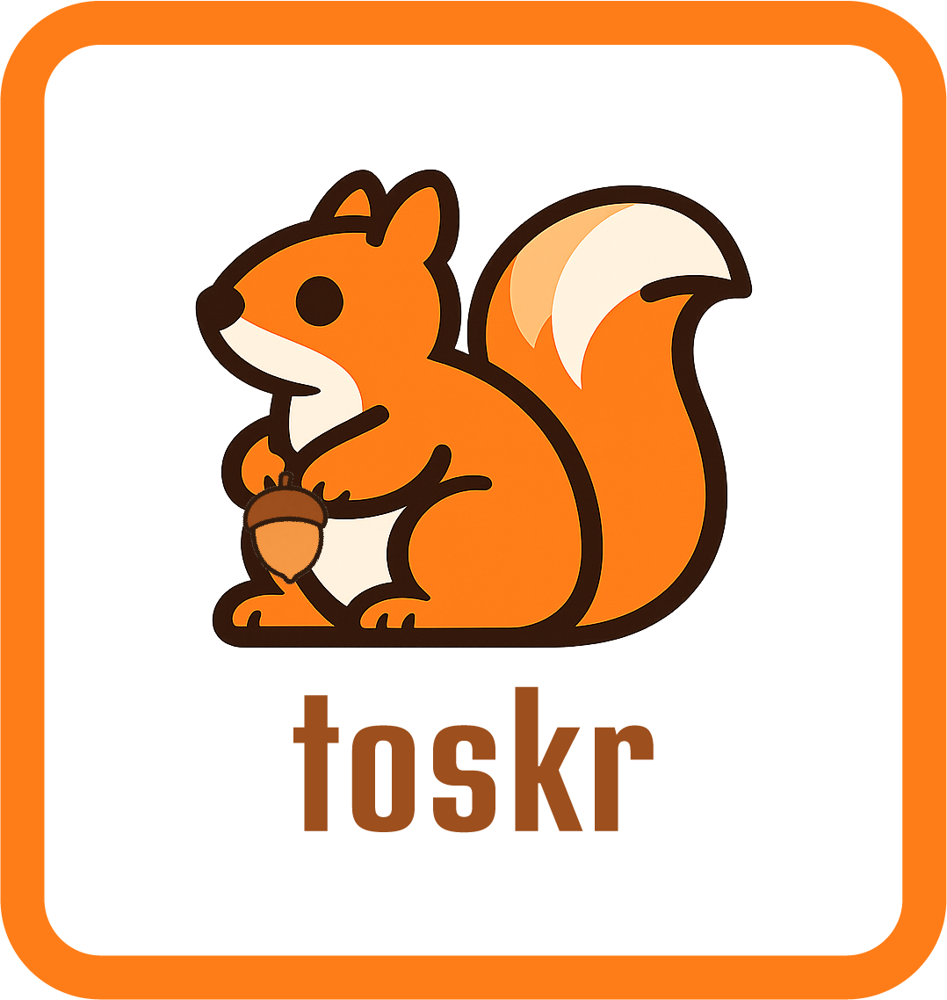

<p align="center">
  
</p>

<h3 align="center">Free live TV and radio streams on your Roku</h3>

<p align="center">
  A sideloadable Roku dev channel that aggregates publicly available live TV and radio streams from around the world.
</p>

---

## What it is

Toskr is a Roku app that lets you browse and watch free, publicly available live TV streams and listen to radio stations. It pulls channel data from [famelack-data](https://github.com/famelack/famelack-data), an open-source directory of stream URLs.

**Four ways to browse:**
- **Country** — pick a country, see its TV channels
- **Surf** — browse TV by category (News, Sports, Entertainment, etc.)
- **Favorites** — channels you've saved with the acorn
- **Radio** — internet radio stations by country

**While watching:**
- Press **Left** to open a transparent overlay menu over the stream
- Switch countries/categories and channels without stopping playback
- Press **Play** to favorite a channel
- Filter by language (English, Spanish, French, and more)
- Search channels and countries

> [!WARNING]
> **Radio is experimental.** Many radio streams in the underlying data are dead, use unsupported protocols, or hang indefinitely. Toskr includes a buffering timeout that will skip to the next stream URL or show "Station unavailable" after 10 seconds, but expect a low hit rate. TV streams are significantly more reliable.

## What it isn't

- **Not a streaming service.** Toskr doesn't host, re-stream, or store any video content.
- **Not in the Roku Channel Store.** This is a sideloaded dev channel for personal use.
- **Not guaranteed to work.** Streams come and go. Some may be geo-blocked, dead, or in unexpected languages.

## Is this legal?

Toskr is a player and directory — it doesn't host or redistribute any content. It points to publicly available HLS streams that are freely accessible on the open internet, aggregated by the open-source [famelack-data](https://github.com/famelack/famelack-data) project (MIT licensed). This is functionally equivalent to bookmarking URLs in a web browser. The app makes no attempt to circumvent DRM, geo-restrictions, or access controls.

## Install

You need a Roku device with Developer Mode enabled.

### 1. Enable Developer Mode

On your Roku remote, press:

```
Home × 3 → Up × 2 → Right → Left → Right → Left → Right
```

Set a developer password when prompted. Note your Roku's IP address.

### 2. Download the latest release

Go to [Releases](https://github.com/yoaquim/toskr/releases) and download `toskr.zip`.

### 3. Sideload

1. Open `http://<your-roku-ip>` in a browser
2. Click **Upload**, select `toskr.zip`
3. Click **Install with zip**

The app appears as a dev channel on your Roku home screen.

## Controls

| Context | OK | Play | Left | Right | Back | Replay |
|---|---|---|---|---|---|---|
| Home screen | Select | Select | Navigate | Navigate | — | — |
| Browse (nav) | Select | Select | Jump to Favorites | Channels | Go home | Search |
| Browse (channels) | Play | Favorite | Back to nav | — | Back to nav | Search |
| Watching TV | — | Favorite | Open overlay | — | Stop | — |
| Listening to Radio | Stop | Favorite | Open overlay | — | Stop | — |
| Overlay | Select | Favorite | Back in overlay | Dismiss | Back / Dismiss | — |

## License

MIT
